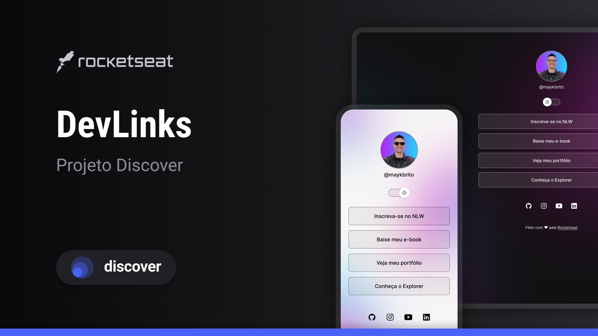

  

  

<h1>🚀 Tecnologias </h1>

Esse projeto foi desenvolvido com as seguintes tecnologias:   
- HTML e CSS  
- JavaScript  
- Figma  
- Git e Github   

<h1>💻 Projeto</h1>

DevLinks para direcionamento ao meu portifólio e contatos. 

<h2>📝 Licença </h2>

Esse projeto está sob a licença MIT.
  

<strong>## Feito com layout by Rocketseat 👋</strong>
